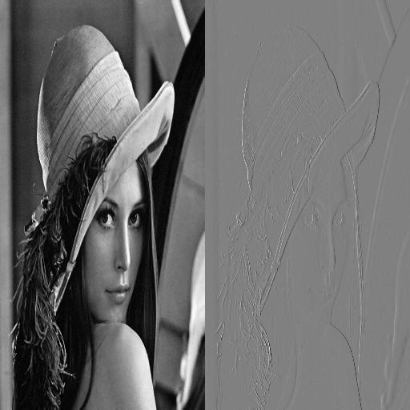

# Haar Wavelet Image Compression Visualization

This is a backend service written in [Go](https://go.dev/) ([Gin](https://github.com/gin-gonic/gin)) that shows the visualization of [image compression with Haar Wavelet](https://medium.com/@digitalpadm/image-compression-haar-wavelet-transform-5d7be3408aa).

## How to use

Visit https://haar.linyuanlin.com to see the visualization.

## How to use (as API service)

Assume you have an image file with name `origin.bmp` (currently only `.bmp` is supported) and you want to compress it.


Post the image to the `/upload` endpoint with form field name `image`: 

```bash
curl -F "image=@origin.bmp" https://api.haar.linyuanlin.com/upload

# > {"id":"e9b6a509-fca1-41b8-ab27-4201396097f1"}
```

You will get the id of the image (`e9b6a509-fca1-41b8-ab27-4201396097f1` in this example).

Then, you can use this id to get each step of the haar wavelet compression:

```bash
curl "https://api.haar.linyuanlin.com/upload/download?uid=e9b6a509-fca1-41b8-ab27-4201396097f1" --output result.jpg
```

The `result.jpg` is identical to the original image, because you don't specify the `step` option. Which means this is `step=0` (original image).


If you want to see the compression result at step `1`, you can use the following command:

```bash
curl "https://api.haar.linyuanlin.com/upload/download?uid=e9b6a509-fca1-41b8-ab27-4201396097f1&step=1" --output result.jpg
```

You can see the result after first step of haar wavelet transform.


